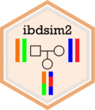

<!-- README.md is generated from README.Rmd. Please edit that file -->

```{r, echo = FALSE}
knitr::opts_chunk$set(
  fig.align = "center",
  collapse = TRUE,
  comment = "#>",
  fig.path = "man/figures/README-"
)
```

# ibdsim2 

<!-- badges: start -->
[](https://CRAN.R-project.org/package=ibdsim2)
[](https://cran.r-project.org/package=ibdsim2)
[](https://cran.r-project.org/package=ibdsim2)
<!-- badges: end -->


## Introduction
The purpose of **ibdsim2** is to simulate and analyse the gene flow in pedigrees. In particular, such simulations can be used to study distributions of chromosomal segments shared _identical-by-descent_ (IBD) by pedigree members. In each meiosis, the recombination process is simulated using sex specific recombination rates in the human genome ([Halldorsson et al., 2019](https://doi.org/10.1126/science.aau1043)), or with recombination maps provided by the user. Additional features include calculation of realised relatedness coefficients, distribution plots of IBD segments, and estimation of two-locus relatedness coefficients.

**ibdsim2** is an updated and improved version of [IBDsim](https://CRAN.R-project.org/package=IBDsim). In particular, the underlying pedigree structure is now imported from the [pedtools](https://CRAN.R-project.org/package=pedtools) package instead of its predecessor [paramlink](https://CRAN.R-project.org/package=paramlink), which is no longer actively developed. In addition to the transition to pedtools, several new features are added in **ibdsim2**, including karyogram plots and analysis of _IBD absence_ between (genealogically) related individuals.

## Installation
To get **ibdsim2**, install from CRAN as follows:
```{r, eval = FALSE}
install.packages("ibdsim2")
```

Alternatively, the latest development version can be installed from GitHub:
```{r, eval = FALSE}
# install.packages("devtools") # if needed
devtools::install_github("magnusdv/ibdsim2")
```

## Example 1: A simple simulation
The most important function in **ibdsim2** is `ibdsim()`, which simulates the recombination process in a given pedigree. In this example we demonstrate this for in a family quartet, and show how to visualise the result.

We start by loading **ibdsim2**.
```{r, message = F}
library(ibdsim2)
```

The main input to `ibdsim()` is a pedigree and a recombination map. In our case we use `pedtools::nuclearPed()` to create the pedigree, and we load chromosome 1 of the built-in map of human recombination.
```{r}
# Pedigree with two siblings
x = nuclearPed(2)

# Recombination map
chr1 = loadMap("decode19", chrom = 1)
```

Now run the simulation! The `seed` argument ensures reproducibility.
```{r quartet-sim, cache = T}
sim = ibdsim(x, N = 1, map = chr1, seed = 1234, verbose = F)
```

The output of `ibdsim()` is a list of length `N` (the number of simulations), where each simulation result is contained in matrix form. Here are the first few rows of the single simulation we just made:
```{r}
head(sim[[1]])
```

Each row of the matrix corresponds to a segment of the genome, and describes the allelic state of the pedigree in that segment. Each individual has two columns, one with the paternal allele (marked by the suffix ":p") and one with the maternal (suffix ":m"). The founders (the parents in our case) are assigned alleles 1, 2, 3 and 4.

The function `haploDraw()` interprets the allele 1-4 as colours, and draws the resulting haplotypes onto the pedigree. See `?haploDraw` for explanation of the arguments.

```{r quartet-haplo, fig.height = 3.5, fig.width = 3.5}
haploDraw(x, sim[[1]], pos = c(2, 4, 1, 1), cols = c(3, 7, 2, 4), 
          margin = c(6, 4, 3, 4))
```

## Example 2: Distributions of IBD segments
In this example we will compare the distributions of counts/lengths of IBD segments between the following pairwise relationships:

* Grandparent/grandchild (GR)
* Half siblings (HS)
* Half uncle/nephew (HU)

Note that GR and HS have the same relatedness coefficients `kappa = (1/2, 1/2, 0)`, meaning that they are genetically indistinguishable in the context of unlinked loci. In contrast, HU has `kappa = (3/4, 1/4, 0)`.

For simplicity we create a pedigree containing all the three relationships we are interested in.
```{r, eval = F}
x = addSon(halfSibPed(), parent = 5)
plot(x)
```

```{r ibdsim2-example-ped, echo = F, fig.height=4, fig.width=5, out.width = "40%", message=F}
x = addSon(halfSibPed(), parent = 5)
plot(x, margin = c(1,1,1,1), cex = 1.3)
```

We store the ID labels of the three relationships in a list.
```{r ibdsim2-example-ids}
ids = list(GR = c(1,7), 
           HS = 4:5, 
           HU = c(4,7))
```

Next, we use `ibdsim()` to produce 1000 simulations of the underlying IBD pattern in the entire pedigree.
```{r ibdsim2-example-sim, cache = T}
s = ibdsim(x, N = 1000, map = loadMap("decode19"))
```

The `plotSegmentDistribution()` function, with the option `type = "ibd1"` analyses the IBD segments in each simulation, and makes a nice plot. Note that the names of the `ids` list are used in the legend.
```{r ibdsim2-example-distplot, fig.height=6, fig.width=7}
plotSegmentDistribution(s, type = "ibd1", ids = ids, shape = 1:3 )
```

We conclude that the three distributions are almost completely disjoint. In particular, this suggests that GR and HS relationships are separable on the basis of their IBD segments, if these can be determined accurately enough.