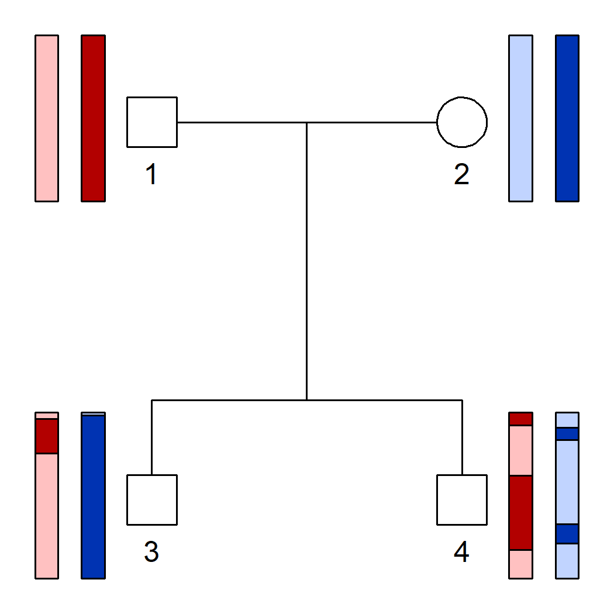

<!-- README.md is generated from README.Rmd. Please edit that file -->

# ibdsim2 

<!-- badges: start -->

[](https://CRAN.R-project.org/package=ibdsim2)
[](https://cran.r-project.org/package=ibdsim2)
[](https://cran.r-project.org/package=ibdsim2)
<!-- badges: end -->

<br>

<span style="color:red; font-size:150%"> Online app for IBD simulations
here: [ibdsim2-shiny](https://magnusdv.shinyapps.io/ibdsim2-shiny/)
</span>

As of version 2.1.0, the Shiny app is integrated as part of the package.
To run it locally, simply run the command

``` r
ibdsim2::launchApp()
```

## Introduction

The purpose of **ibdsim2** is to simulate and analyse the gene flow in
pedigrees. In particular, such simulations can be used to study
distributions of chromosomal segments shared *identical-by-descent*
(IBD) by pedigree members. In each meiosis, the recombination process is
simulated using sex specific recombination rates in the human genome
([Halldorsson et al., 2019](https://doi.org/10.1126/science.aau1043)),
or with recombination maps provided by the user. Additional features
include calculation of realised relatedness coefficients, distribution
plots of IBD segments, and estimation of two-locus relatedness
coefficients.

**ibdsim2** is part of the
[pedsuite](https://magnusdv.github.io/pedsuite/) collection of packages
for pedigree analysis in R. A detailed presentation of these packages,
including a separate chapter on **ibdsim2**, is available in the book
[Pedigree analysis in
R](https://www.google.com/books/edition/Pedigree_Analysis_in_R/uhkIEAAAQBAJ)
(Vigeland, 2021).

## Installation

To get **ibdsim2**, install from CRAN as follows:

``` r
install.packages("ibdsim2")
```

Alternatively, install the latest development version from GitHub:

``` r
# install.packages("remotes")
remotes::install_github("magnusdv/ibdsim2")
```

## Example 1: A simple simulation

The most important function in **ibdsim2** is `ibdsim()`, which
simulates the recombination process in a given pedigree. In this example
we demonstrate this for in a family quartet, and show how to visualise
the result.

We start by loading **ibdsim2**.

``` r
library(ibdsim2)
```

The main input to `ibdsim()` is a pedigree and a recombination map. In
our case we use `pedtools::nuclearPed()` to create the pedigree, and we
load chromosome 1 of the built-in map of human recombination.

``` r
# Pedigree with two siblings
x = nuclearPed(2)

# Recombination map
chr1 = loadMap("decode19", chrom = 1)
```

Now run the simulation! The `seed` argument ensures reproducibility.

``` r
sim = ibdsim(x, N = 1, map = chr1, seed = 1, verbose = F)
```

The output of `ibdsim()` is a matrix (or a list of matrices, if
`N > 1`). Here are the first few rows of the simulation we just made:

``` r
head(sim)
#>      chrom   startMB     endMB   startCM     endCM 1:p 1:m 2:p 2:m 3:p 3:m 4:p 4:m
#> [1,]     1  0.000000  4.647215  0.000000  8.201478   1   2   3   4   1   3   2   3
#> [2,]     1  4.647215  9.324570  8.201478 17.302931   1   2   3   4   1   4   2   3
#> [3,]     1  9.324570 19.734471 17.302931 39.094957   1   2   3   4   2   4   2   3
#> [4,]     1 19.734471 22.758411 39.094957 43.760232   1   2   3   4   2   4   1   3
#> [5,]     1 22.758411 41.449745 43.760232 66.991502   1   2   3   4   2   4   1   4
#> [6,]     1 41.449745 61.342551 66.991502 86.497704   1   2   3   4   2   4   1   3
```

Each row of the matrix corresponds to a segment of the genome, and
describes the allelic state of the pedigree in that segment. Each
individual has two columns, one with the paternal allele (marked by the
suffix “:p”) and one with the maternal (suffix “:m”). The founders (the
parents in our case) are assigned alleles 1, 2, 3 and 4.

The function `haploDraw()` interprets the founder alleles as colours and
draws the resulting haplotypes onto the pedigree. See `?haploDraw` for
an explanation of `pos` and other arguments.

``` r
haploDraw(x, sim, pos = c(2, 4, 2, 4))
```



## Example 2: Distributions of IBD segments

In this example we will compare the distributions of counts/lengths of
IBD segments between the following pairwise relationships:

- Grandparent/grandchild (GR)
- Half siblings (HS)
- Half uncle/nephew (HU)

Note that GR and HS have the same relatedness coefficients
`kappa = (1/2, 1/2, 0)`, meaning that they are genetically
indistinguishable in the context of unlinked loci. In contrast, HU has
`kappa = (3/4, 1/4, 0)`.

For simplicity we create a pedigree containing all the three
relationships we are interested in.

``` r
x = halfSibPed() |> addSon(5)
plot(x)
```


We store the ID labels of the three relationships in a list.

``` r
ids = list(GR = c(2,7), 
           HS = 4:5, 
           HU = c(4,7))
```

Next, we use `ibdsim()` to produce 500 simulations of the underlying IBD
pattern in the entire pedigree.

``` r
s = ibdsim(x, N = 500, map = "decode19", seed = 1234)
#> Simulation parameters:
#> Simulations  : 500
#> Chromosomes  : 1-22
#> Genome length: 2875 Mb
#>                2602.29 cM (male)
#>                4180.42 cM (female)
#> Recomb model : chi
#> Target indivs: 1-7
#> Skip recomb  : -
#> Total time used: 1.71 secs
```

The `plotSegmentDistribution()` function, with the option
`type = "ibd1"` analyses the IBD segments in each simulation, and makes
a nice plot. Note that the names of the `ids` list are used in the
legend.

``` r
plotSegmentDistribution(s, type = "ibd1", ids = ids, shape = 1:3)
```


We conclude that the three distributions are almost completely disjoint.
Hence the three relationships can typically be distinguished on the
basis of their IBD segments, if these can be determined accurately
enough.

*A Shiny app for visualising IBD distributions is available here:
<https://magnusdv.shinyapps.io/ibdsim2-shiny/>.*
