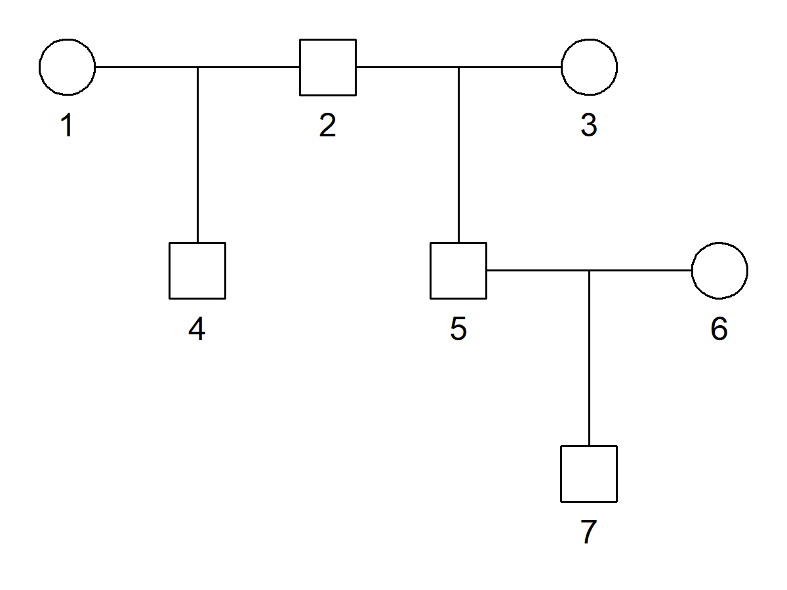
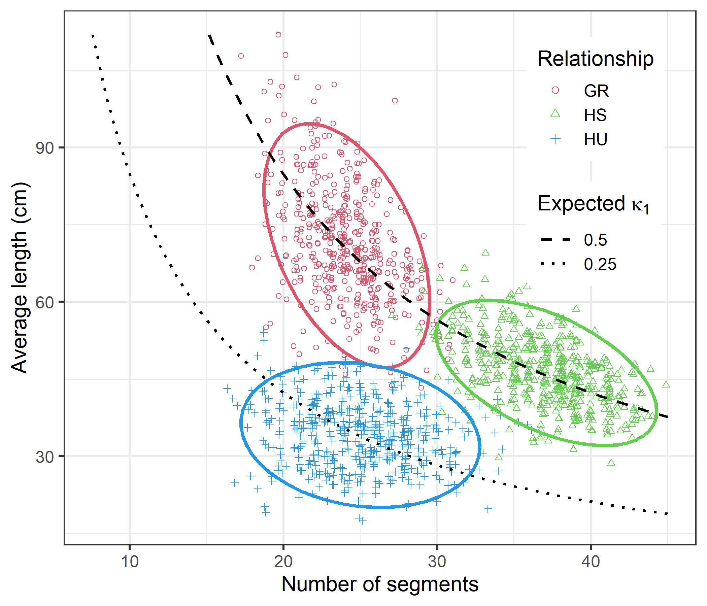

<!-- README.md is generated from README.Rmd. Please edit that file -->

# ibdsim2 

## Introduction

The purpose of **ibdsim2** is to simulate and analyse the gene flow in
pedigrees. In particular, such simulations can be used to study
distributions of chromosomal segments shared *identical-by-descent*
(IBD) by pedigree members. In each meiosis, the recombination process is
simulated using sex specific recombination rates in the human genome
(Kong et al., (2010) <doi:10.1038/nature09525>), or with recombination
maps provided by the user. Additional features include calculation of
realised relatedness coefficients, distribution plots of IBD segments,
and estimation of two-locus relatedness coefficients.

**ibdsim2** is an updated and improved version of
[IBDsim](https://CRAN.R-project.org/package=IBDsim). In particular, the
underlying pedigree structure is now imported from the
[pedtools](https://github.com/magnusdv/pedtools) package instead of its
predecessor [paramlink](https://CRAN.R-project.org/package=paramlink),
which is no longer actively developed. In addition to the transition to
pedtools, several new features are added in **ibdsim2**, including
karyogram plots and analysis of *IBD absence* between (genealogically)
related individuals.

## Installation

**ibdsim2** is under development and can be installed from GitHub as
follows:

``` r
 # First install devtools if needed
if(!require(devtools)) install.packages("devtools")

# Install pedtools from github
devtools::install_github("magnusdv/ibdsim2")
```

## Example: Distributions of IBD segments

The plot below compares the joint distributions of counts and sizes of
IBD segments between the following pairwise relationships:

  - Grandparent/grandchild (GR)
  - Half siblings (HS)
  - Half uncle/nephew (HU)

To produce the plot, we start by loading **ibdsim2**.

``` r
library(ibdsim2)
```

For simplicity we create a pedigree containing all the three
relationships we are interested in.

``` r
x = addSon(halfSibPed(), parent = 5)
plot(x)
```



We store the ID labels of the three relationships in a list. (The names
of this list are used in the legend of the distribution plot below.)

``` r
ids = list(GR = c(1,7), 
           HS = 4:5, 
           HU = c(4,7))
```

Next, we use `ibdsim()` to produce 1000 simulations of the underlying
IBD pattern in the entire pedigree.

``` r
s = ibdsim(x, N = 1000, map = "uniform.sex.spec")
#> Simulation parameters:
#> No. of sims: 1000
#> Chromosomes: 1-22
#> Total len  : 2864.3 Mb
#> Rec. model : chi
#> Target ids : 1-7
#> Skip recomb: -
#> Total time used: 14.8 secs
```

The `plotSegmentDistribution()` function, with the option `type =
"ibd1"` analyses the IBD=1 segments in each simulation, and makes a nice
plot:

``` r
plotSegmentDistribution(s, type = "ibd1", ids = ids, shape = 1:3 )
```


